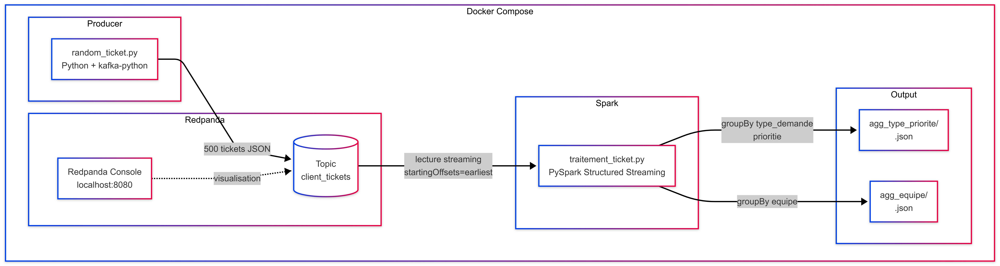

## Context

Ce projet a été réalisé dans le cadre de mon parcours de formation 'Data Engineer' avec OpenClassrooms.

Titre du projet :

`Gérez des tickets clients avec Redpanda et PySpark`

Ce projet consiste à mettre en place un pipeline de données pour ingérer, traiter et analyser des tickets en temps réel en utilisant Redpanda, PySpark et PostgreSQL.

Le but de cet exercice est de simuler l’utilisation de Redpanda dans un conteneur Docker, avec le pipeline suivant :
- 1 broker Redpanda en mode dev-container
- Producer qui génère des tickets progressivement
- Spark en streaming
- PostgreSQL pour stocker les agrégations cumulatives
- Export final en JSON 

Démonstration : 
🎥 [Voir la démo vidéo](https://www.loom.com/share/76a71580c8654a5bbcee8b6862b7ed29)

## Installations

### Docker

[Docker Desktop](https://www.docker.com/products/docker-desktop/) (windows/mac)
[Docker Engine](https://docs.docker.com/engine/install/) (Linux)

---

# Déroulé complet du docker-compose.yml :

1. Redpanda démarre  
`redpanda-0` → healthcheck (`rpk cluster info`) → `service_healthy`  
Docker attend que Redpanda soit réellement prêt à accepter des connexions avant de continuer.

2. PostgreSQL démarre  
`postgres` → healthcheck (`pg_isready`) → `service_healthy`  
La base `tickets_db` est prête à recevoir les tables d’agrégation.

3. Console démarre  
`redpanda-0 healthy` → console démarre  
L'interface web Redpanda devient accessible sur `localhost:8080`.

4. Producer démarre  
`redpanda-0 healthy` → producer démarre  
Le script `random_ticket.py` génère et envoie 500 tickets dans le topic `client_tickets` avec un délai entre chaque ticket.

5. Spark démarre  
`redpanda-0 healthy` + `postgres healthy` → spark démarre  
Spark lit `client_tickets` en streaming, agrège les tickets par micro-batch et met à jour PostgreSQL avec un `upsert`.

6. Export final JSON  
Une fois le streaming terminé, `export_final_json.py` lit PostgreSQL et génère les fichiers JSON finaux dans `./output/`.

Résultats finaux :
- `./output/final_agg_equipe.json`
- `./output/final_agg_type_priorite.json`

## Reprise et arrêt

Le traitement Spark conserve un checkpoint dans `./output/checkpoints/ticket_aggregation`.

- si Spark est arrêté proprement, il reprend au bon endroit au redémarrage
- si l’arrêt arrive pendant un micro-batch, le dernier batch peut éventuellement être rejoué
- si le checkpoint est supprimé, Spark repart du début du topic

## Commandes utiles

**Docker**
- docker compose down -v (supprime les conteneurs et les volumes associés)
- docker compose up (voir le démarrage et le debug en direct)
- docker compose up -d (lancer l’environnement puis continuer à travailler)

**Spark**
- Remove-Item -Recurse -Force .\output\checkpoints\ticket_aggregation (enlever les sauvegardes checkpoint)
- docker compose logs -f spark (logs spark)

Télécharger manuellement les json une fois l'envoie des tickets terminés:
docker compose stop spark
docker compose run --rm spark python3 /opt/spark/work/export_final_json.py
